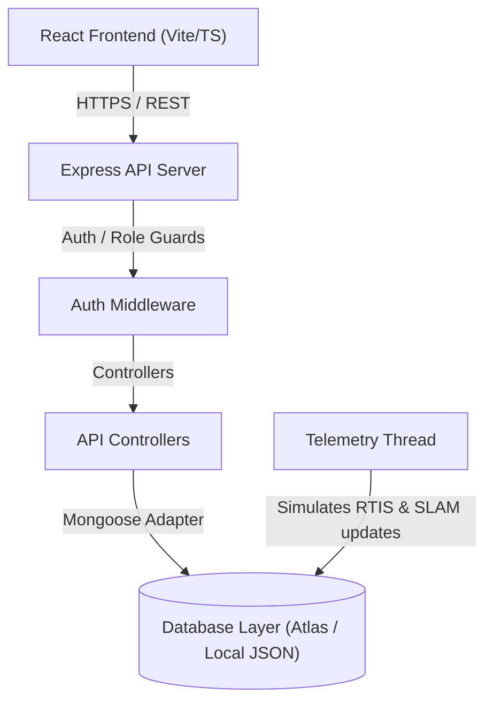
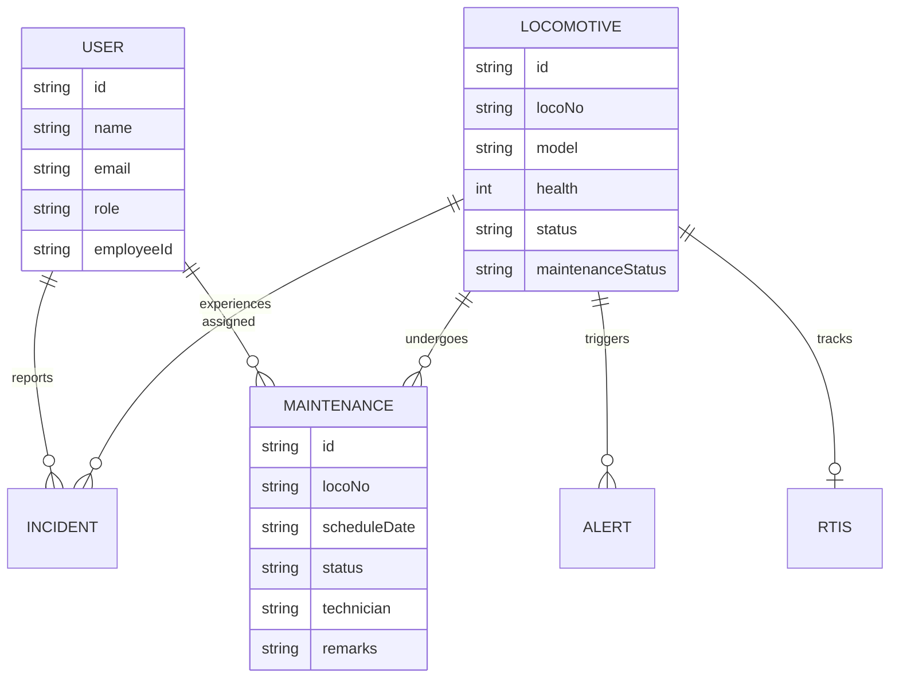
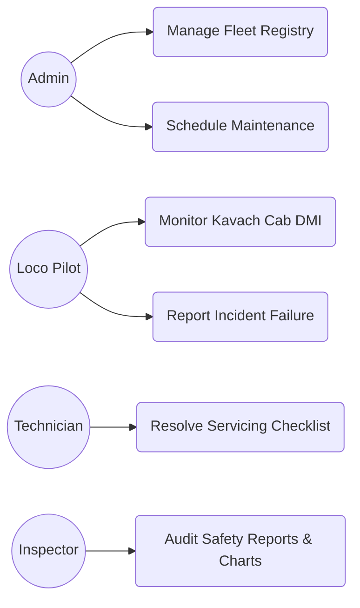
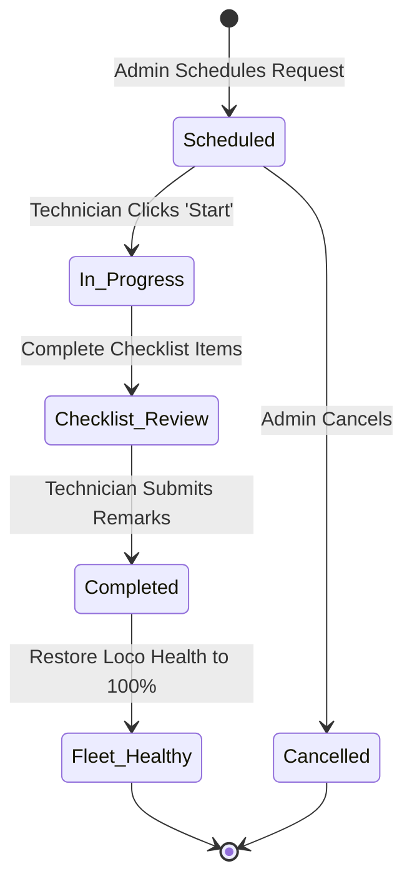
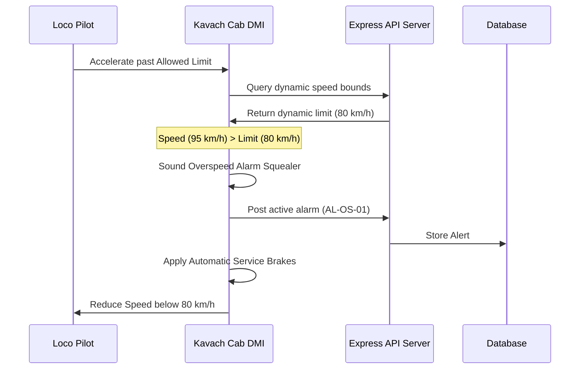
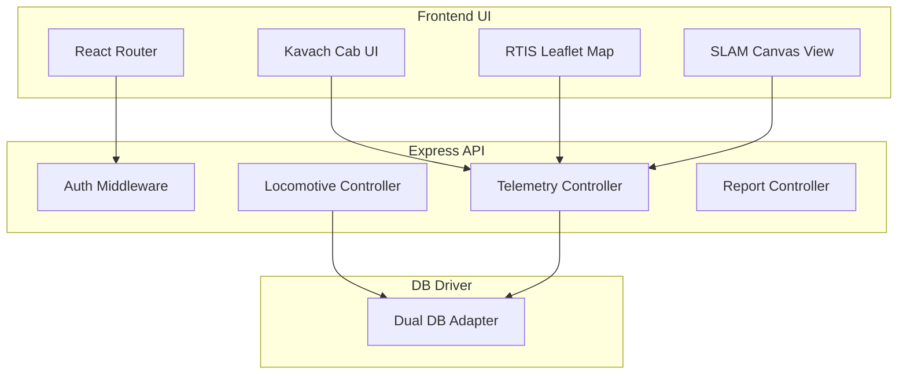
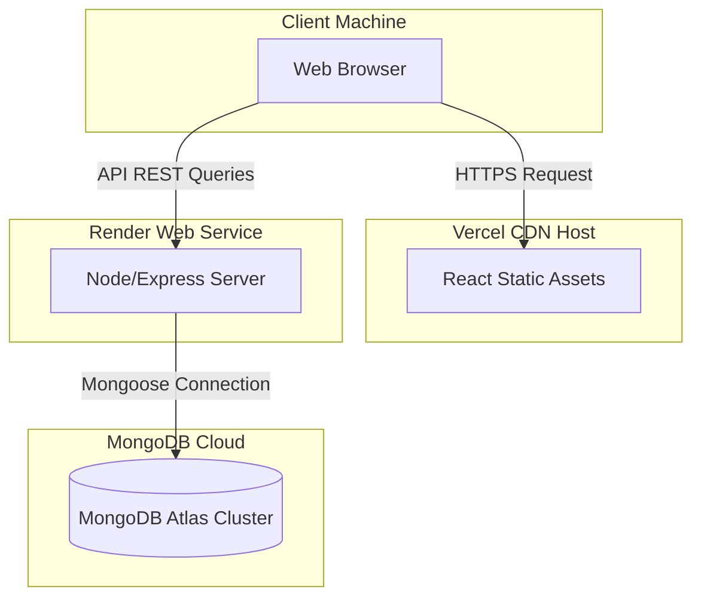

# Project Report: RailSafe360 Portal

**Title**: RailSafe360 – Intelligent Railway Safety & Maintenance Management Portal  
**Domain**: Indian Railways Safety Operations & Electric Loco Shed Management  
**Inspiration**: Industrial Internship, Electric Loco Shed (ELS), Jamalpur  

---

## 1. Abstract

RailSafe360 is a full-stack, enterprise-grade safety and maintenance management portal. Inside railway locomotive sheds (such as ELS Jamalpur), maintenance schedules, failure tracking, and telemetry monitoring are traditionally handled in fragmented, legacy systems. RailSafe360 integrates real-time train tracking (RTIS), high-integrity collision avoidance monitors (Kavach), indoor localization and mapping systems (SLAM) for shed workshops, and predictive diagnostics. 

Designed for scalability, the system implements role-based authentication and a dual-mode database driver to run reliably in low-connectivity local shed environments.

---

## 2. Project Objectives

- **Implement Cab Monitor (Kavach)**: Simulate warning systems for signal overspeed, SPAD (Signal Passed at Danger), and track occupancy alerts.
- **Track Fleet Telemetry (RTIS)**: Map train speed, coordinate pathways, and ETA schedules.
- **Map Workshops (SLAM)**: Visualize autonomous inspection rovers navigating bays, mapping tracks, and avoiding obstacles.
- **Support Servicing Workflows**: Standardize maintenance schedules, checklists, and engineer assignments.
- **Analyze Failures**: Log mechanical and communication incidents with interactive timelines and charts.
- **Generate Audit Sheets**: Facilitate instant print templates and Excel CSV downloads.

---

## 3. System Architecture & Diagrams

### 3.1 System Architecture Diagram
The system follows a Model-View-Controller (MVC) pattern. The React frontend queries Express REST controllers, which interface with MongoDB or fallback JSON files.

---

### 3.2 Entity-Relationship (ER) Diagram
Shows data models and relationships for locomotives, servicing requests, user profiles, incidents, and telemetry streams.

---

### 3.3 Use Case Diagram
Maps the actions authorized for each system user role.

---

### 3.4 Activity Diagram
Depicts the maintenance lifecycle workflow from scheduling to completion.

---

### 3.5 Sequence Diagram
Simulates the communication flow during a Kavach automatic speed limit warning.

---

### 3.6 Component Diagram
Details the functional software units in the codebase.

---

### 3.7 Deployment Diagram
Shows how compiled files are deployed in production environments.

---

## 4. System Requirements

### 4.1 Software Requirements
- **Operating System**: Windows 10/11, Linux, or macOS.
- **Node.js**: v18.0.0 or higher.
- **NPM Package Manager**: v9.0.0 or higher.
- **Database**: MongoDB v6.0+ or Local JSON file system.
- **Web Browser**: Chrome, Edge, Firefox, or Safari.

### 4.2 Hardware Requirements
- **Processor**: Intel Core i3 / AMD Ryzen 3 or higher.
- **Memory**: 4 GB RAM minimum (8 GB recommended).
- **Storage**: 200 MB free space for code and local database logs.

---

## 5. Future Scope

1. **Computer Vision Pit Inspections**: Integrate camera feeds beneath tracks to automatically identify crack faults in suspension bogie springs using edge AI models.
2. **Kavach SIL-4 Hardware Integration**: Link the portal to real RFID beacon readers and telemetry transmitters via MQTT or WebSockets.
3. **Bogie Vibration Spectrograms**: Process raw vibration data through Fast Fourier Transforms (FFT) in the predictive maintenance module to identify specific bearings that require grease lubrication.

---

## 6. Conclusion

RailSafe365 successfully integrates key computer science concepts with industrial railway operations. The project demonstrates the utility of real-time telemetry systems, autonomous mapping (SLAM), and rule-based diagnostic classifiers in improving railway safety and maintenance efficiency at Electric Loco Sheds.

---

## 7. References

1. *Kavach (TCAS) Specifications*: Research Designs and Standards Organisation (RDSO), Ministry of Railways, Government of India.
2. *Real Time Information System (RTIS) Documentation*: Centre for Railway Information Systems (CRIS), New Delhi.
3. *Simultaneous Localization and Mapping (SLAM) Algorithms*: Probabilistic Robotics, Sebastian Thrun.
